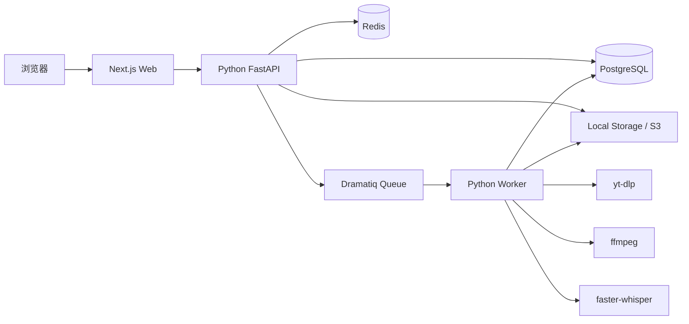

# 英语听力练习项目最终技术选型

## 结论

最终方案：

```text
前端：Next.js + React + TypeScript
后端：Python + FastAPI
数据库：PostgreSQL
队列：Redis + Dramatiq
媒体处理：ffmpeg + yt-dlp + faster-whisper
存储：本地 storage 起步，后续切 S3/R2/MinIO
```

## 前端不变

前端继续使用：

- Next.js
- React
- TypeScript
- Tailwind CSS
- TanStack Query
- Zustand
- 原生 Audio / Web Audio

原因：

- 听写练习页交互复杂，React 更适合做状态管理
- 快捷键、音频播放、输入框即时反馈都在浏览器侧
- 后续做移动端 Web/PWA 更方便

## 后端明确使用 Python

后端使用：

- FastAPI：API 服务
- SQLAlchemy 2.x：ORM
- Alembic：数据库迁移
- Pydantic v2：数据校验
- PostgreSQL：主数据库
- Redis：队列 broker 和缓存
- Dramatiq：后台任务
- ffmpeg：音视频处理
- yt-dlp：YouTube/Bilibili 下载
- faster-whisper：语音转写
- pysubs2 / srt / webvtt-py：字幕解析

## 总体架构



## 仓库结构

```text
english-listening/
  apps/
    web/                  # Next.js + React + TypeScript
    api/                  # Python FastAPI
  packages/
    shared/               # 可选，共享 OpenAPI 类型生成结果
  storage/                # 本地开发存储
  docker-compose.yml
```

后端结构：

```text
apps/api/
  pyproject.toml
  src/listenflow/
    main.py
    config.py
    db.py
    security.py
    storage.py
    modules/
      auth/
      materials/
      media_jobs/
      subtitles/
      sentences/
      practice/
      favorites/
      wrongbook/
    workers/
      media_pipeline.py
      transcribe.py
      segment_audio.py
  tests/
```

前端结构：

```text
apps/web/
  package.json
  src/
    app/
      materials/
      practice/
      favorites/
      wrongbook/
    components/
    features/
    lib/
```

## 开发顺序

1. 建 monorepo
2. 建 FastAPI 后端骨架
3. 建 Next.js 前端骨架
4. Docker Compose 启动 PostgreSQL + Redis
5. 实现用户登录
6. 实现资料上传和 material/job 状态
7. 实现 Python worker 媒体流水线
8. 实现听写练习页
9. 实现进度、收藏、错题

## 和上一版文档的关系

- `architecture.md`：主技术架构，可继续作为详细设计
- `architecture-python.md`：Python 全栈备选方案，暂不采用
- `architecture-final.md`：当前最终确认方案，以这个为准

