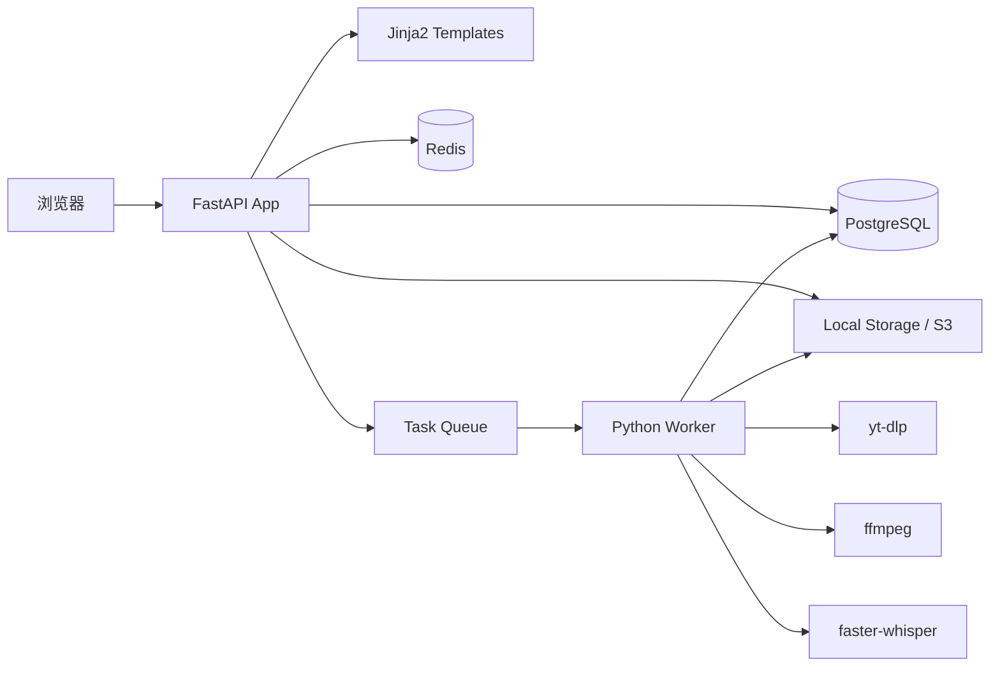

# 英语听力练习项目 Python 技术架构设计

## 1. 技术路线结论

按“用 Python”的要求，推荐第一版走 Python-first 架构：

```text
FastAPI + Jinja2 + HTMX + Tailwind CSS + PostgreSQL + Redis + Celery/Dramatiq + ffmpeg + faster-whisper
```

说明：

- 后端、页面渲染、任务处理全部由 Python 主导
- 不上 Next.js，不引入重前端工程
- 练习页保留少量原生 JavaScript，用于音频播放、快捷键、输入框状态
- 这样开发速度快，部署简单，后续真需要复杂前端时再拆 React

## 2. 总体架构



## 3. 后端技术栈

### Web 框架

- FastAPI
- Uvicorn
- Jinja2Templates
- Starlette StaticFiles

### 数据层

- PostgreSQL
- SQLAlchemy 2.x
- Alembic
- asyncpg 或 psycopg3

### 任务队列

推荐二选一：

- Dramatiq + Redis：更轻，代码简单
- Celery + Redis：生态成熟，任务监控工具多

MVP 推荐 Dramatiq。

### 音视频处理

- ffmpeg：抽音频、转码、切句音频
- yt-dlp：YouTube/Bilibili 下载
- faster-whisper：语音转字幕
- pysubs2 / srt / webvtt-py：字幕解析

### 前端增强

- Jinja2：服务端渲染页面
- HTMX：局部刷新、表单提交、任务进度轮询
- Tailwind CSS：样式
- 原生 JavaScript：练习页音频播放和快捷键

## 4. 项目目录

遵循 Python `src` 布局：

```text
english-listening/
  pyproject.toml
  uv.lock
  README.md
  .env.example
  docker-compose.yml
  alembic.ini
  src/
    listenflow/
      __init__.py
      main.py
      config.py
      db.py
      security.py
      storage.py
      queue.py
      web/
        routes.py
        templates/
          base.html
          materials/
          practice/
          wrongbook/
        static/
          css/
          js/
      modules/
        auth/
        materials/
        media_jobs/
        subtitles/
        sentences/
        practice/
        favorites/
        wrongbook/
      workers/
        media_pipeline.py
        transcribe.py
        segment_audio.py
  tests/
    unit/
    integration/
  storage/
    .gitkeep
```

## 5. 页面设计

### 服务端页面

```text
GET /login
GET /materials
GET /materials/new
GET /materials/{material_id}
GET /practice/continue
GET /practice/materials/{material_id}
GET /favorites
GET /wrongbook
GET /settings
```

### HTMX 局部接口

```text
GET  /partials/materials
GET  /partials/jobs/{job_id}
GET  /partials/materials/{material_id}/groups
GET  /partials/groups/{group_id}/sentences
POST /partials/practice/sentences/{sentence_id}/submit
POST /partials/favorites/{sentence_id}
POST /partials/wrongbook/{sentence_id}/mastered
```

### JSON API

给练习页 JavaScript 和后续移动端预留：

```text
GET  /api/practice/continue
GET  /api/sentences/{sentence_id}
POST /api/practice/sentences/{sentence_id}/submit
POST /api/practice/progress
GET  /api/jobs/{job_id}
```

## 6. 核心数据模型

### users

```sql
id uuid primary key
email text unique not null
password_hash text not null
created_at timestamptz not null
updated_at timestamptz not null
```

### materials

```sql
id uuid primary key
user_id uuid not null references users(id)
title text not null
source_type text not null
source_url text
original_file_key text
audio_file_key text
cover_file_key text
duration_ms integer
language text not null default 'en'
category text
status text not null
group_size integer not null default 10
error_message text
created_at timestamptz not null
updated_at timestamptz not null
```

### media_jobs

```sql
id uuid primary key
material_id uuid not null references materials(id)
type text not null
status text not null
current_step text
progress integer not null default 0
error_code text
error_message text
retry_count integer not null default 0
started_at timestamptz
finished_at timestamptz
created_at timestamptz not null
updated_at timestamptz not null
```

### practice_groups

```sql
id uuid primary key
material_id uuid not null references materials(id)
title text not null
order_index integer not null
sentence_count integer not null default 0
created_at timestamptz not null
```

### sentences

```sql
id uuid primary key
material_id uuid not null references materials(id)
group_id uuid references practice_groups(id)
text text not null
start_ms integer not null
end_ms integer not null
audio_clip_key text
order_index integer not null
created_at timestamptz not null
updated_at timestamptz not null
```

### sentence_blanks

```sql
id uuid primary key
sentence_id uuid not null references sentences(id)
word text not null
normalized_word text not null
start_index integer
end_index integer
order_index integer not null
created_at timestamptz not null
```

### user_progress

```sql
id uuid primary key
user_id uuid not null references users(id)
material_id uuid not null references materials(id)
group_id uuid references practice_groups(id)
sentence_id uuid references sentences(id)
updated_at timestamptz not null
unique(user_id, material_id)
```

### practice_records

```sql
id uuid primary key
user_id uuid not null references users(id)
sentence_id uuid not null references sentences(id)
correct_count integer not null default 0
wrong_count integer not null default 0
consecutive_correct_count integer not null default 0
last_practiced_at timestamptz
unique(user_id, sentence_id)
```

### favorite_sentences

```sql
id uuid primary key
user_id uuid not null references users(id)
sentence_id uuid not null references sentences(id)
created_at timestamptz not null
unique(user_id, sentence_id)
```

### wrong_sentences

```sql
id uuid primary key
user_id uuid not null references users(id)
sentence_id uuid not null references sentences(id)
wrong_count integer not null default 0
mastered boolean not null default false
last_wrong_at timestamptz
created_at timestamptz not null
updated_at timestamptz not null
unique(user_id, sentence_id)
```

## 7. 媒体处理流水线

### 上传文件

```text
1. 用户上传文件
2. FastAPI 保存原始文件
3. 创建 material
4. 创建 media_job
5. 投递后台任务
6. worker 抽音频
7. worker 提取字幕或 Whisper 转写
8. worker 生成句子和分组
9. worker 切句子音频
10. worker 抽关键词
11. material 标记 ready
```

### 链接导入

```text
1. 用户提交 YouTube/Bilibili URL
2. FastAPI 创建 material 和 media_job
3. worker 使用 yt-dlp 下载
4. 优先提取平台字幕
5. 没有字幕则 faster-whisper 转写
6. 生成句子、分组、音频切片、关键词
7. material 标记 ready
```

### 状态机

```text
created
uploading
uploaded
downloading
extracting_subtitle
transcribing
segmenting
ready
failed
```

## 8. 练习页交互架构

练习页使用服务端渲染首屏：

```text
GET /practice/materials/{material_id}
```

首屏包含：

- 当前资料
- 当前分组
- 当前句子
- 填空词位置
- 音频 URL
- 收藏状态
- 当前练习进度

前端少量 JS 负责：

- 音频播放/暂停
- 默认播放两遍
- 快捷键
- 输入框焦点切换
- 正确变绿色
- 全部正确后 Enter 下一句

后端负责最终判定：

```text
POST /api/practice/sentences/{sentence_id}/submit
```

答案 normalize：

- trim
- lower
- 去掉可忽略标点
- 缩写规则后续扩展

## 9. 文件存储

本地开发：

```text
storage/
  users/{user_id}/
    materials/{material_id}/
      original/source.mp4
      audio/full.wav
      clips/sentence_000001.mp3
      subtitles/source.vtt
      subtitles/normalized.json
      cover/cover.jpg
```

正式环境：

- 同样 key 结构
- 后端通过 storage adapter 切换本地/S3

## 10. 部署方案

### 开发环境

```text
uv run uvicorn listenflow.main:app --reload
docker compose up postgres redis
uv run dramatiq listenflow.workers.media_pipeline
```

### MVP 部署

Docker Compose：

```text
app        FastAPI + Jinja2
worker     Python media worker
postgres   database
redis      queue/cache
minio      local S3-compatible storage
```

### 后续扩展

- API 和 worker 分开机器
- worker 可部署到 GPU 机器
- storage 切 Cloudflare R2
- PostgreSQL 切托管数据库

## 11. 测试策略

Python 项目要求：

- pytest
- pytest-cov
- ruff
- mypy strict

最低测试：

- 字幕解析测试
- 句子切分测试
- 关键词抽取测试
- 答案 normalize 测试
- 错题三次加入规则测试
- progress 恢复测试
- material/job 状态机测试

覆盖率目标：

```text
Python >= 80%
```

## 12. MVP 开发顺序

### Phase 1：Python 项目骨架

- uv 初始化
- FastAPI
- Jinja2
- SQLAlchemy
- Alembic
- PostgreSQL
- Redis
- Dramatiq
- Docker Compose
- Ruff/Mypy/Pytest

### Phase 2：用户和资料

- 登录注册
- 资料列表
- 文件上传
- URL 导入
- job 状态展示

### Phase 3：媒体流水线

- ffmpeg 抽音频
- 字幕解析
- faster-whisper 转写
- 句子切分
- 每 10 句分组
- 音频切片
- 关键词抽取

### Phase 4：听写练习

- 练习页面
- 音频播放两遍
- 填空输入
- 正确变绿
- 回车下一句
- 快捷键
- 进度保存

### Phase 5：收藏和错题

- 收藏句子
- 错题累计
- 三次错误自动加入
- 错题练习
- 掌握标记

## 13. 关键取舍

- 不用 Next.js，第一版减少复杂度
- 不做重 SPA，页面主要服务端渲染
- 练习页允许少量 JS，因为音频和快捷键必须在浏览器侧处理
- Bilibili 支持预留，MVP 先把上传和 YouTube 做稳
- AI 分类后置，先做手动分类 + 简单规则

## 14. 最终推荐

这个项目第一版用 Python 完全可以做，而且更适合快速闭环。

最终架构：

```text
FastAPI SSR + HTMX + small vanilla JS + PostgreSQL + Redis + Dramatiq + ffmpeg + faster-whisper
```

后续用户量起来，或者练习页交互复杂到服务端模板撑不住，再拆 React 前端。

