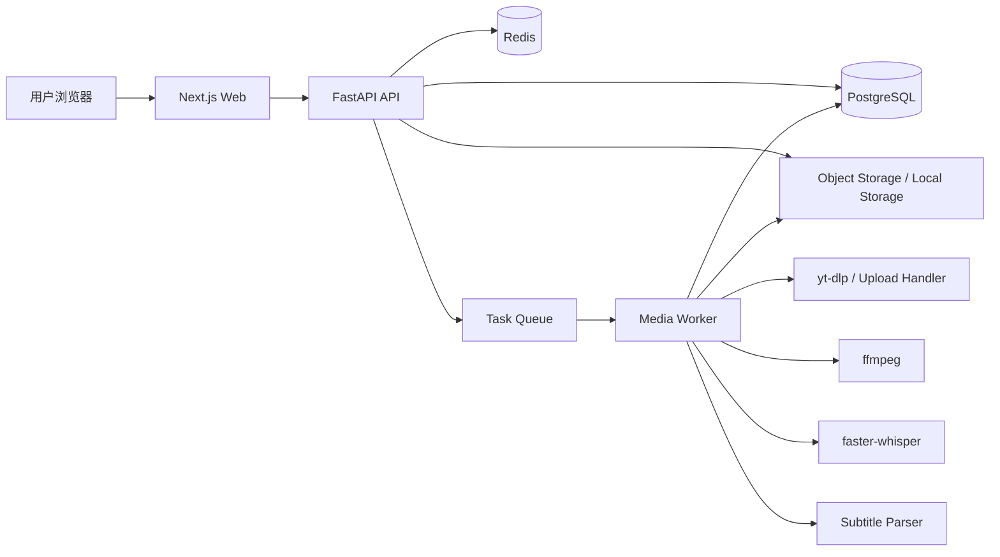
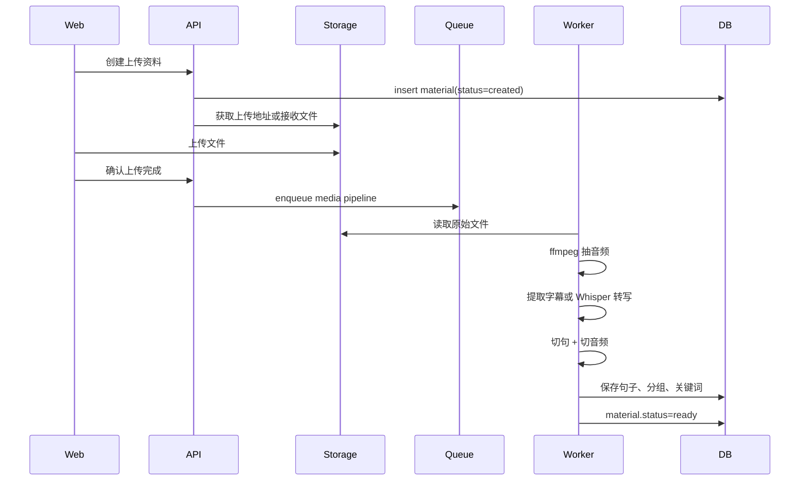
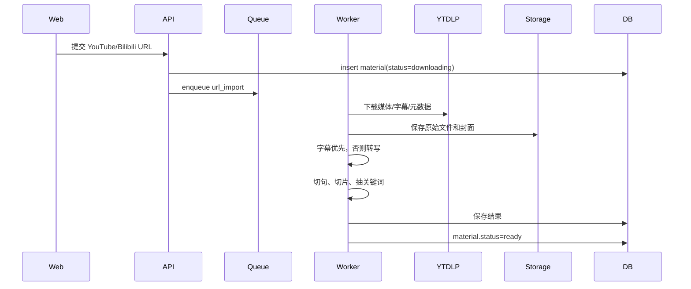

# 英语听力练习项目技术架构设计

## 1. 架构目标

第一版目标不是做大而全平台，而是先打通核心闭环：

```text
导入资料 -> 下载/上传 -> 提取字幕/语音转写 -> 切句/切音频 -> 生成填空练习 -> 练习记录 -> 收藏/错题
```

关键要求：

- 长任务异步化，上传、下载、转写、切片不阻塞页面
- 练习页响应快，音频播放、输入判定、快捷键交互要顺
- 数据模型先支持 MVP，后续能扩展 AI 分类、词汇难度、移动端
- 文件、密钥、第三方平台账号信息必须隔离，不能硬编码

## 2. 推荐技术栈

### 前端

- Next.js + React + TypeScript
- Tailwind CSS 或 CSS Modules
- Zustand：练习页本地状态
- TanStack Query：服务端数据请求和缓存
- Howler.js 或原生 Web Audio：句子音频播放控制

### 后端

- Python 3.12+
- FastAPI
- SQLAlchemy 2.x
- Alembic
- Pydantic v2
- PostgreSQL
- Redis
- Celery / RQ / Dramatiq（三选一，建议 Dramatiq 或 Celery）

### 音视频处理

- ffmpeg：转码、抽音频、切句音频
- yt-dlp：YouTube/Bilibili 下载，MVP 可先只正式支持 YouTube
- faster-whisper：本地转写优先
- pysubs2 / srt / webvtt-py：字幕解析

### 存储

MVP 本机开发：

- 本地文件系统：`storage/`

正式部署：

- S3 兼容对象存储：Cloudflare R2 / MinIO / AWS S3
- 数据库只保存文件 key，不保存大文件内容

## 3. 总体架构



### 服务拆分

MVP 先单体仓库，逻辑分层清楚即可：

```text
apps/
  web/        Next.js 前端
  api/        FastAPI 后端
packages/
  shared/     共享类型，后续可选
storage/      本地开发文件存储
```

后端内部按模块拆：

```text
api/
  src/listenflow/
    main.py
    core/
      config.py
      security.py
      storage.py
      task_queue.py
    modules/
      auth/
      users/
      materials/
      media_jobs/
      subtitles/
      sentences/
      practice/
      favorites/
      wrongbook/
    workers/
      media_pipeline.py
      transcribe.py
      segment_audio.py
```

## 4. 核心模块设计

### 4.1 Auth 用户模块

MVP 功能：

- 邮箱密码登录
- JWT access token
- 用户级数据隔离

后续可加：

- OAuth
- 订阅/套餐
- 团队空间

### 4.2 Materials 资料模块

负责资料生命周期：

- 创建资料记录
- 上传文件
- 导入链接
- 查询资料列表
- 查询资料详情
- 删除资料
- 更新标题、分类、分组配置

资料状态建议：

```text
created
uploading
uploaded
downloading
extracting_subtitle
transcribing
segmenting
ready
failed
```

### 4.3 Media Job 任务模块

每次上传或链接导入都创建一个后台任务。

任务类型：

- `upload_process`
- `url_import`
- `subtitle_extract`
- `transcribe`
- `sentence_segment`
- `audio_clip`
- `keyword_extract`

任务表记录：

- 当前步骤
- 进度百分比
- 错误信息
- 重试次数
- started_at / finished_at

### 4.4 Subtitle 字幕模块

字幕来源优先级：

1. 用户上传字幕
2. 平台字幕
3. Whisper 自动转写

字幕统一转成内部结构：

```json
{
  "text": "Students learn better when practice is immediate and repeated.",
  "start_ms": 12400,
  "end_ms": 16800
}
```

### 4.5 Sentence 句子模块

职责：

- 清洗字幕文本
- 合并过短片段
- 拆分过长片段
- 生成句子顺序
- 每 N 句生成一个 PracticeGroup
- 调用 ffmpeg 生成句子音频片段

MVP 规则：

- 默认每 10 句一组
- 句子太短可与下一句合并
- 单句音频切片保留前后 150ms buffer

### 4.6 Keyword 填空词模块

MVP 不要一开始做复杂 NLP。建议先用规则：

- 去掉停用词：the, a, an, is, are, of 等
- 优先抽取名词、动词、形容词、副词
- 长度小于 3 的词默认不抽
- 每句默认 1-3 个空
- 用户可手动编辑关键词

后续再升级：

- spaCy 词性分析
- CEFR 词汇等级
- 用户错词优先
- LLM 辅助抽关键词

### 4.7 Practice 练习模块

职责：

- 获取当前练习句子
- 校验填空答案
- 记录正确/错误次数
- 更新当前进度
- 错误累计三次加入错题集

判定规则：

- 默认忽略大小写
- 默认忽略首尾空格
- 可配置是否忽略标点
- 缩写要特殊处理，例如 `don't` / `do not`
- MVP 先做 exact normalized match

### 4.8 Favorites 收藏模块

职责：

- 收藏句子
- 取消收藏
- 收藏列表
- 从收藏句子开始练习

### 4.9 Wrongbook 错题模块

规则：

- 同一句任一填空错误，句子 wrong_count +1
- wrong_count >= 3 自动进入错题集
- 错题练习连续答对 3 次，标记为 mastered
- mastered 不删除，只在默认列表降级隐藏

## 5. 媒体处理流水线

### 5.1 上传文件流程



### 5.2 链接导入流程



### 5.3 失败处理

所有任务失败都要保存：

- failed_step
- error_code
- error_message
- retryable

典型失败：

- 下载失败
- 平台限制
- 文件格式不支持
- ffmpeg 处理失败
- Whisper 转写失败
- 文件过大

MVP 需要提供“重试”按钮。

## 6. 数据库设计

### 6.1 users

```sql
id uuid primary key
email text unique not null
password_hash text not null
created_at timestamptz not null
updated_at timestamptz not null
```

### 6.2 materials

```sql
id uuid primary key
user_id uuid not null references users(id)
title text not null
source_type text not null -- upload | youtube | bilibili
source_url text
original_file_key text
audio_file_key text
cover_file_key text
duration_ms integer
language text default 'en'
category text
status text not null
group_size integer not null default 10
error_message text
created_at timestamptz not null
updated_at timestamptz not null
```

### 6.3 media_jobs

```sql
id uuid primary key
material_id uuid not null references materials(id)
type text not null
status text not null -- queued | running | succeeded | failed
current_step text
progress integer not null default 0
error_code text
error_message text
retry_count integer not null default 0
started_at timestamptz
finished_at timestamptz
created_at timestamptz not null
updated_at timestamptz not null
```

### 6.4 practice_groups

```sql
id uuid primary key
material_id uuid not null references materials(id)
title text not null
order_index integer not null
sentence_count integer not null default 0
created_at timestamptz not null
```

### 6.5 sentences

```sql
id uuid primary key
material_id uuid not null references materials(id)
group_id uuid references practice_groups(id)
text text not null
start_ms integer not null
end_ms integer not null
audio_clip_key text
order_index integer not null
created_at timestamptz not null
updated_at timestamptz not null
```

### 6.6 sentence_blanks

```sql
id uuid primary key
sentence_id uuid not null references sentences(id)
word text not null
normalized_word text not null
start_index integer
end_index integer
difficulty text
order_index integer not null
created_at timestamptz not null
```

### 6.7 user_progress

```sql
id uuid primary key
user_id uuid not null references users(id)
material_id uuid not null references materials(id)
group_id uuid references practice_groups(id)
sentence_id uuid references sentences(id)
updated_at timestamptz not null
unique(user_id, material_id)
```

### 6.8 practice_records

```sql
id uuid primary key
user_id uuid not null references users(id)
sentence_id uuid not null references sentences(id)
correct_count integer not null default 0
wrong_count integer not null default 0
consecutive_correct_count integer not null default 0
last_practiced_at timestamptz
unique(user_id, sentence_id)
```

### 6.9 favorite_sentences

```sql
id uuid primary key
user_id uuid not null references users(id)
sentence_id uuid not null references sentences(id)
created_at timestamptz not null
unique(user_id, sentence_id)
```

### 6.10 wrong_sentences

```sql
id uuid primary key
user_id uuid not null references users(id)
sentence_id uuid not null references sentences(id)
wrong_count integer not null default 0
mastered boolean not null default false
last_wrong_at timestamptz
created_at timestamptz not null
updated_at timestamptz not null
unique(user_id, sentence_id)
```

## 7. API 设计

### Auth

```http
POST /api/auth/register
POST /api/auth/login
GET  /api/auth/me
```

### Materials

```http
GET    /api/materials
POST   /api/materials/upload
POST   /api/materials/import-url
GET    /api/materials/{material_id}
PATCH  /api/materials/{material_id}
DELETE /api/materials/{material_id}
POST   /api/materials/{material_id}/retry
```

### Groups / Sentences

```http
GET /api/materials/{material_id}/groups
GET /api/groups/{group_id}/sentences
GET /api/sentences/{sentence_id}
PATCH /api/sentences/{sentence_id}
PATCH /api/sentences/{sentence_id}/blanks
```

### Practice

```http
GET  /api/practice/continue
GET  /api/practice/materials/{material_id}/continue
POST /api/practice/sentences/{sentence_id}/submit
POST /api/practice/progress
```

`submit` 请求示例：

```json
{
  "answers": [
    {
      "blank_id": "uuid",
      "value": "immediate"
    }
  ]
}
```

响应示例：

```json
{
  "all_correct": true,
  "results": [
    {
      "blank_id": "uuid",
      "correct": true,
      "expected": null
    }
  ],
  "wrong_count": 0,
  "added_to_wrongbook": false
}
```

### Favorites

```http
GET    /api/favorites
POST   /api/favorites/{sentence_id}
DELETE /api/favorites/{sentence_id}
```

### Wrongbook

```http
GET  /api/wrongbook
POST /api/wrongbook/{sentence_id}/practice
POST /api/wrongbook/{sentence_id}/mastered
```

### Jobs

```http
GET /api/jobs/{job_id}
GET /api/materials/{material_id}/jobs
```

## 8. 前端页面架构

### 页面

```text
/login
/materials
/materials/new
/materials/[id]
/practice/continue
/practice/material/[materialId]
/practice/group/[groupId]
/favorites
/wrongbook
/settings
```

### 前端状态

服务端状态：

- 用户信息
- 资料列表
- 资料详情
- 句子列表
- 任务进度
- 收藏/错题列表

使用 TanStack Query。

练习页本地状态：

- 当前句子
- 播放次数
- 输入框值
- 当前焦点
- 是否全部正确
- 快捷键状态
- 自动播放状态

使用 Zustand 或局部 reducer。

### 练习页设计要点

- 音频元素预加载当前句和下一句
- 输入判定尽量前端即时做，提交时以后端为准
- 快捷键只在练习页生效，输入框内避免冲突
- 正确答案不立即暴露，除非用户点击显示答案

## 9. 文件存储结构

本地开发：

```text
storage/
  users/{user_id}/
    materials/{material_id}/
      original/
        source.mp4
      audio/
        full.wav
      clips/
        sentence_000001.mp3
        sentence_000002.mp3
      subtitles/
        source.vtt
        normalized.json
      cover/
        cover.jpg
```

对象存储 key 也按这个结构走。

## 10. 后台任务设计

### 任务入口

```python
process_material(material_id: UUID) -> None
```

### 内部步骤

```text
1. load material
2. download source if URL
3. extract metadata
4. extract audio
5. find subtitle
6. transcribe if subtitle missing
7. normalize subtitle
8. build sentences
9. create groups
10. cut sentence audio clips
11. extract blanks
12. mark material ready
```

### 幂等性

每个步骤都要尽量可重复运行：

- 已下载文件存在则跳过下载
- 已生成 full audio 则跳过抽音频
- 已有 normalized subtitles 则跳过转写
- 已有 sentence clips 可按缺失补齐

这样重试不会把数据弄脏。

## 11. 部署架构

### MVP 单机部署

适合先内测：

```text
Docker Compose
  web
  api
  worker
  postgres
  redis
  minio
```

优点：

- 简单
- 好调试
- 成本低

### 后续生产部署

```text
Frontend: Vercel / Cloudflare Pages
API: Docker on VPS / Fly.io / Render
Worker: 独立 GPU/CPU 机器
DB: Managed PostgreSQL
Redis: Managed Redis
Storage: R2 / S3
```

注意：Whisper 转写吃 CPU/GPU，后续最好把 worker 单独部署，避免拖垮 API。

## 12. 安全设计

- JWT secret、数据库密码、对象存储 key 走环境变量
- 上传文件类型白名单
- 上传文件大小限制
- 用户只能访问自己的 material/sentence/progress
- 文件下载 URL 使用短期签名
- 链接导入要限制域名和下载大小
- 后台任务不能直接信任用户传入的 URL 文件名

## 13. 观测与日志

MVP 至少要有：

- API request log
- worker job log
- material 处理状态
- job error_code
- job error_message

建议错误码：

```text
DOWNLOAD_FAILED
SUBTITLE_NOT_FOUND
TRANSCRIBE_FAILED
FFMPEG_FAILED
UNSUPPORTED_FORMAT
FILE_TOO_LARGE
STORAGE_FAILED
```

## 14. MVP 开发阶段拆分

### Phase 1：项目骨架

- Monorepo
- Next.js
- FastAPI
- PostgreSQL
- Redis
- Docker Compose
- Auth

### Phase 2：资料导入

- 上传音频/视频
- YouTube URL 导入
- material/job 状态
- 文件存储

### Phase 3：转写与切句

- ffmpeg 抽音频
- 字幕解析
- faster-whisper 转写
- 句子生成
- 每 10 句分组
- 音频切片

### Phase 4：听写练习

- 练习页
- 句子播放
- 默认播放两遍
- 填空输入
- 正确变绿
- 回车下一句
- 快捷键

### Phase 5：学习数据

- 进度恢复
- 收藏句子
- 错题集
- 三次错误自动加入

### Phase 6：打磨

- 错误重试
- 任务进度实时刷新
- 关键词编辑
- 资料分类
- 移动端适配

## 15. 我建议的取舍

第一版建议这么砍：

- Bilibili 先放后面，yt-dlp 支持可以预留，但不要承诺稳定
- 自动内容分类先用用户手动分类 + 简单规则，别一开始上复杂 AI 分类
- 关键词抽取先规则化，不要一开始追求智能
- 先做 Web，不先做 App
- Whisper 优先本地 faster-whisper，成本可控
- 单机 Docker Compose 先跑通，worker 后续再单独拆出去

## 16. 最大技术风险

### 16.1 平台链接导入不稳定

YouTube/Bilibili 下载可能受地区、登录、风控影响。

解决：

- 上传文件作为兜底
- 链接导入失败给明确原因
- 不把平台导入作为唯一入口

### 16.2 转写耗时

长视频转写可能几分钟到几十分钟。

解决：

- 后台任务
- 明确进度
- 可重试
- worker 独立部署

### 16.3 时间轴不准

字幕或 Whisper 时间轴不准会影响单句播放。

解决：

- 切片加 buffer
- 后续支持手动微调
- 太短句子合并

### 16.4 答案判定体验

大小写、标点、缩写会导致误判。

解决：

- 统一 normalize
- MVP 忽略大小写和首尾空格
- 缩写规则单独处理

## 17. 结论

这个项目的核心难点不在普通 CRUD，而在媒体处理流水线和练习体验。

正确路线：

1. 先把资料导入、转写、切句、音频切片做稳
2. 再把听写页交互做顺
3. 最后叠加 AI 分类、词汇难度、个性化推荐

MVP 技术架构推荐：

```text
Next.js + FastAPI + PostgreSQL + Redis + Worker + ffmpeg + faster-whisper + S3/R2
```

